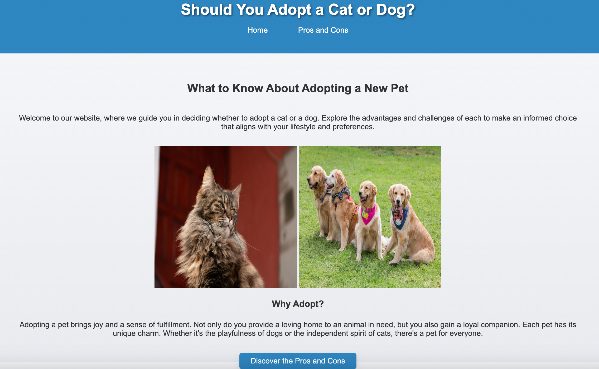
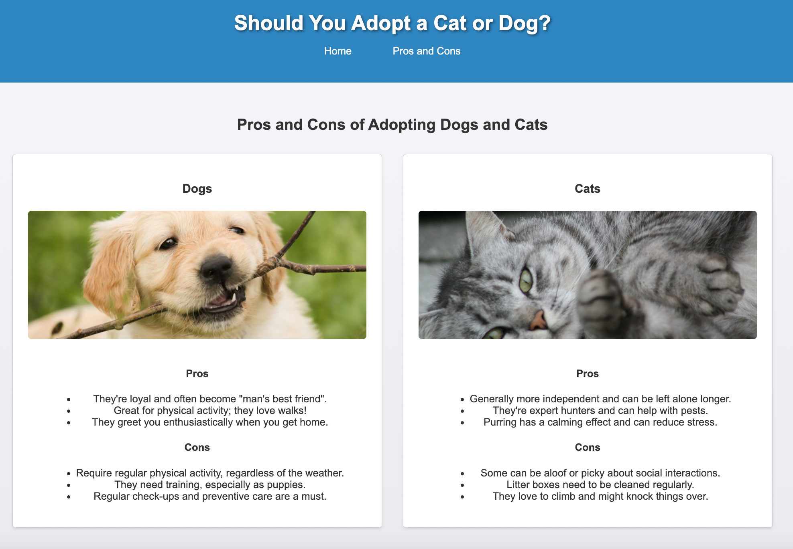

# Pet Adoption Project 🐱🐶

## Introduction
Welcome to the Pet Adoption Project! This repository contains a simple yet engaging website aimed at guiding prospective pet owners through the process of adopting a new furry friend. Whether you're inclined towards the independent charm of a cat or the playful nature of a dog, this site offers a deep dive into the advantages and challenges of adopting either.

## Background
This project emerged from Codefellows' 101 course during a one-day intensive training session. While the initial foundation was laid out during this training, the journey didn't end there. I took the skills learned and blended them with additional knowledge acquired post-class, refining the website to its current form. This endeavor was more than just a coding exercise; it symbolized our united vision to promote a cause dear to us - pet adoption. Through this website, I not only aimed to demonstrate our budding 1 day technical expertise but also hoped to shed light on the profound impact of adopting a pet, one heartwarming story at a time.

    
    

## Features

- 🐾 **Pet Selection Guide**: Discover the advantages and challenges of adopting either a cat or a dog.
  
- 📱 **Responsive Design**: The website is optimized for all device sizes, ensuring a seamless user experience whether viewed on mobile, tablet, or desktop.
  
- 🌐 **Simple Navigation**: Navigating between the homepage and the pros-and-cons page is a breeze, thanks to the intuitive menu.

## Technical Highlights

The creation of this website involved a blend of foundational web development techniques and advanced design principles:

- **HTML**: Our site's foundation. Acquired during the Codefellows' training, HTML provides the structure—defining sections, headings, images, navigation, and more—to ensure a coherent layout and clear information hierarchy.

- **CSS**: The art behind our site's aesthetics. Learned during the training, CSS defines the website's visual appeal, from typography to colors, ensuring it's not just functional but also visually engaging.

### Post-class Enhancements:

- **Flexbox**: Post-training, I delved into Flexbox—a modern CSS layout mechanism. This facilitated the design of complex layout structures in a streamlined manner, ideal for distributing space and aligning items, especially when the size is dynamic.

- **CSS Grid**: Venturing further into CSS, I stumbled upon the CSS Grid—a powerful tool for creating two-dimensional layouts. It was pivotal for the 'Pros and Cons' section, ensuring information was presented in a clear grid pattern, boosting readability.

- **Responsive Design**: Recognizing the ubiquity of mobile devices, a post-class learning was adopting a mobile-first design approach. Through media queries and fluid grids, the website was reshaped into a fully responsive entity, ensuring a uniform experience across diverse devices.
